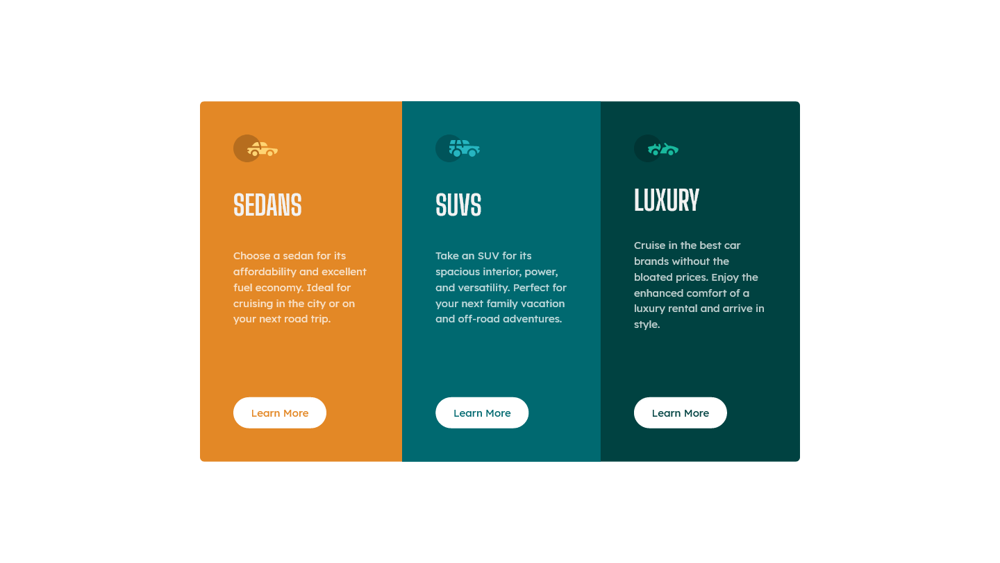

# Frontend Mentor - 3-column preview card component solution

This is a solution to the [3-column preview card component challenge on Frontend Mentor](https://www.frontendmentor.io/challenges/3column-preview-card-component-pH92eAR2-). Frontend Mentor challenges help you improve your coding skills by building realistic projects.

## Table of contents

- [Overview](#overview)
  - [The challenge](#the-challenge)
  - [Screenshot](#screenshot)
  - [Links](#links)
- [My process](#my-process)
  - [Built with](#built-with)
  - [What I learned](#what-i-learned)
  - [Continued development](#continued-development)
  - [Useful resources](#useful-resources)
- [Author](#author)

## Overview

### The challenge

Users should be able to:

- View the optimal layout depending on their device's screen size
- See hover states for interactive elements

### Screenshot

### Links

- Live Site URL: [3 column preview card component](https://paul-henry662.github.io/3-column-preview-card-component/)

## My process

### Built with

- Semantic HTML5 markup
- CSS custom properties
- Flexbox
- CSS Grid
- Mobile-first workflow

### What I learned

For this challenge, I tried to use the grid layout assoiated with flexbox (I think flexbox alone would have done the job, but i really wanted to learn more about how to use grids). I discovered that they are a really powerful association. The card itself is a 3-column grid while each section is a flex container. I simplifies the process a lot.
Also, based on the report on my first challenge solution, I discovered the brand new world of Accessiblity. I placed the whole content in a main tag with ARIA main role.

### Continued development

I'll definetely dig further into accessibility stuff. Also, I'll try to master the grid layout.

### Useful resources

- [W3schools grid layout](https://www.w3schools.com/css/css_grid.asp) - The grid layout.

## Author

- Frontend Mentor - [@Paul-henry662](https://www.frontendmentor.io/profile/Paul-henry662)
